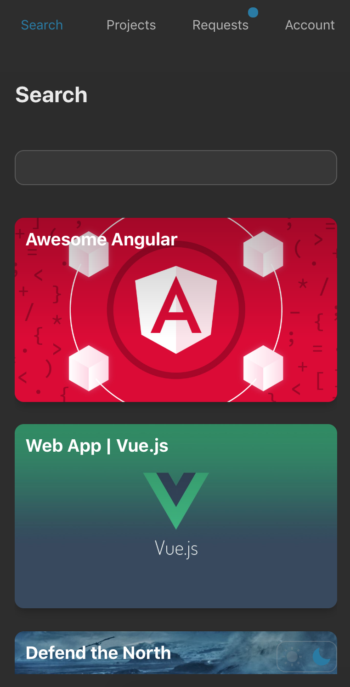

## Teamapp 
[LIVE DEMO](https://projects-app.olegakan5326.now.sh/)
<strong style='color: #3AAD4E'>version 0.1 BETA</strong>

The app is a new collaboration platform, designed to help users to discover and work on a projects they might be interested in. Users can also create their own projects and accept join requests in real time.

## Setting up

```sh
git clone https://github.com/olegakan/teamapp-client.git
npm install
npm test
npm start
```

## API
[Link](https://github.com/olegakan/teamapp-server)

The app uses Express App to retrieve data from the database. 
If you have any suggestions or encountring any issues with api requests please check out [API issues tab](https://github.com/olegakan/teamapp-server/issues)

## Issues

Looking to contribute? Pick an issue from the [issues](https://github.com/olegakan/teamapp-client/issues) tab.

## Feature Requests

Please file an [issue](https://github.com/olegakan/teamapp-client/issues) to suggest new features. Vote by adding 👍 on feature request to help us prioritize what to work on.

## Screenshots

<div style='
  display: flex;
  justify-content: space-around;
  flex-wrap: wrap;
'>
  
  
  
</div>
<div style='
  display: flex;
  justify-content: space-around;
  flex-wrap: wrap;
  margin-top: 10px;
'>
  
  
  
</div>

## Licence

MIT